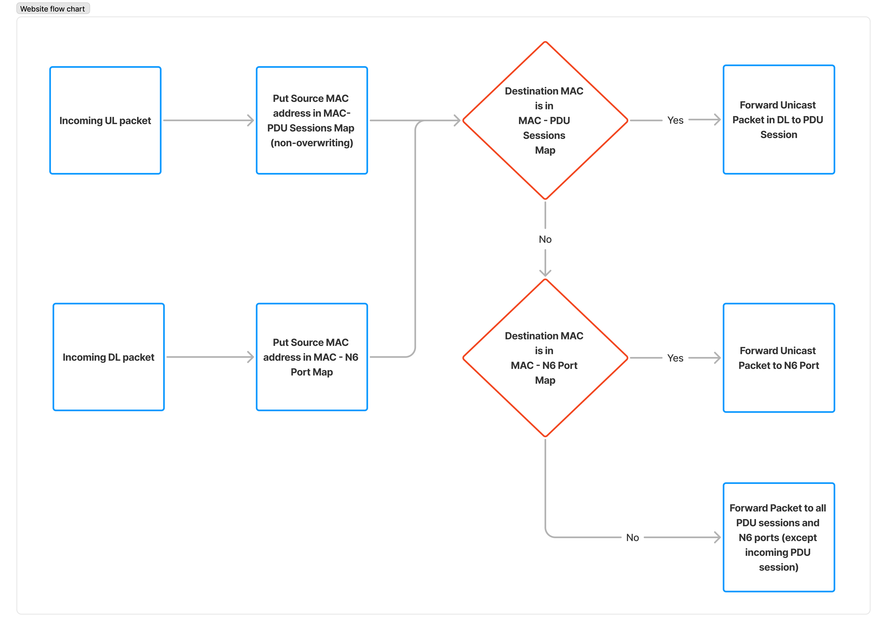

# Ethernet PDU Sessions with OAI 5G Core Network

This tutorial explains how to configure and use Ethernet PDU sessions with the OAI 5G Core network. Ethernet PDU sessions allow transporting Ethernet frames between UE and Data Network (DN) through the 5G core, enabling various use cases like enterprise networking and industrial IoT applications.

## 1. Prerequisites


Create a folder where you can store all the result files of the tutorial and later compare them with our provided result files, we recommend creating exactly the same folder to not break the flow of commands afterwards

<!---
For CI purposes please ignore this line
``` shell
docker-compose-host $: rm -rf /tmp/oai/ethernet-pdu-sessions
```
-->

``` shell
docker-compose-host $: mkdir -p /tmp/oai/ethernet-pdu-sessions
docker-compose-host $: chmod 777 /tmp/oai/ethernet-pdu-sessions
```

## 2. Architecture Overview

The Ethernet PDU session support in OAI 5G Core enables:

* Ethernet frame forwarding between UE and Data Network
* Proper handling of Ethernet PDU session establishment procedures
* Support for multiple PDU session types simultaneously (IPv4, IPv6, Ethernet)



## 3. Database Configuration

First, we need to configure the subscriber database to support Ethernet PDU sessions. Update your database with a UE subscription that includes PDU session type "ETHERNET".

 In the table `SessionManagementSubscriptionData` in [oai_db2.sql](../docker-compose/database/oai_db2.sql) add below entries. Execute the following SQL statement to insert a UE with Ethernet PDU session support:

```sql
INSERT INTO `SessionManagementSubscriptionData` (`ueid`, `servingPlmnid`, `singleNssai`, `dnnConfigurations`) VALUES
('208950000000035', '20895', '{\"sst\": 222, \"sd\": \"00007B"}','{\"default\":{\"pduSessionTypes\":{ \"defaultSessionType\": \"ETHERNET\"},\"sscModes\": {\"defaultSscMode\": \"SSC_MODE_1\"},\"5gQosProfile\": {\"5qi\": 6,\"arp\":{\"priorityLevel\": 1,\"preemptCap\": \"NOT_PREEMPT\",\"preemptVuln\":\"NOT_PREEMPTABLE\"},\"priorityLevel\":1},\"sessionAmbr\":{\"uplink\":\"150Mbps\", \"downlink\":\"150Mbps\"}}, \"ethernet\":{\"pduSessionTypes\":{ \"defaultSessionType\": \"ETHERNET\"},\"sscModes\": {\"defaultSscMode\": \"SSC_MODE_1\"},\"5gQosProfile\": {\"5qi\": 6,\"arp\":{\"priorityLevel\": 1,\"preemptCap\": \"NOT_PREEMPT\",\"preemptVuln\":\"NOT_PREEMPTABLE\"},\"priorityLevel\":1},\"sessionAmbr\":{\"uplink\":\"150Mbps\", \"downlink\":\"150Mbps\"}}}');
```

## 4. UPF Configuration

Update the UPF configuration to support Ethernet PDU sessions. Edit the [basic_nrf_config_ebpf.yaml](../docker-compose/conf/basic_nrf_config_ebpf.yaml) file:

```yaml
upf:
  support_features:
    enable_bpf_datapath: yes    # If "on": BPF is used as datapath else simpleswitch is used, DEFAULT= off
    enable_eth_pdu: yes      # If "on": ETHERNET PDU sessions are supported, DEFAULT= off

dnns:
  - dnn: "oai"
    pdu_session_type: "IPV4"
    ipv4_subnet: "12.1.1.128/25"
  - dnn: "oai.ipv4"
    pdu_session_type: "IPV4"
    ipv4_subnet: "12.1.1.64/26"
  - dnn: "default"
    pdu_session_type: "ETHERNET"
    ipv4_subnet: "12.1.1.0/26"
  - dnn: "ims"
    pdu_session_type: "IPV4V6"
    ipv4_subnet: "14.1.1.2/24"
```

> **Note** that for Ethernet PDU sessions, the `ipv4_subnet` field is not actually used but must be present in the configuration for compatibility.

## 5. Network Function Deployment

In the previous tutorial we explain how to deploy the core network using our [python deployer](../docker-compose/core-network.py). Here we will only provide quick commands needed to deploy the core network, to learn how to use the python deployer please follow [this page](./DEPLOY_SA5G_MINI_WITH_GNBSIM.md).

- Start the core network components, check which scenario you are using with nrf or without nrf

As a first timer, we recommend to first run without any PCAP capture.

``` console
docker-compose-host $: python3 core-network.py --type start-basic-ebpf --scenario 1
```

For CI purposes, we are deploying with an automated PCAP capture on the docker network.

> **REMEMBER: if you are planning to run your CN5G deployment for a long time, the PCAP file can become huge!**

``` shell
docker-compose-host $: python3 core-network.py --type start-basic-ebpf --scenario 1 --capture /tmp/oai/ethernet-pdu-sessions/ethernet-pdu-sessions.pcap
```
<details>
<summary>The output will look like this:</summary>

```
[2025-10-30 11:47:31,354] root:DEBUG:  OAI 5G Core network started, checking the health status of the containers... takes few secs....
[2025-10-30 11:47:31,354] root:DEBUG: docker-compose -f docker-compose-basic-nrf-ebpf.yaml ps -a
[2025-10-30 11:47:45,579] root:DEBUG:  All components are healthy, please see below for more details....
Name                 Command                  State                                      Ports
---------------------------------------------------------------------------------------------------------------------------------
mysql        docker-entrypoint.sh mysqld      Up (healthy)   3306/tcp, 33060/tcp
oai-amf      /openair-amf/bin/oai_amf - ...   Up (healthy)   38412/sctp, 5342/tcp, 5343/tcp, 5344/tcp, 80/tcp, 8080/tcp, 9090/tcp
oai-ausf     /openair-ausf/bin/oai_ausf ...   Up (healthy)   5342/tcp, 5343/tcp, 5344/tcp, 80/tcp, 8080/tcp
oai-ext-dn   /bin/bash /tmp/trfgen_entr ...   Up (healthy)
oai-nrf      /openair-nrf/bin/oai_nrf - ...   Up (healthy)   5342/tcp, 5343/tcp, 5344/tcp, 80/tcp, 8080/tcp
oai-smf      /openair-smf/bin/oai_smf - ...   Up (healthy)   5342/tcp, 5343/tcp, 5344/tcp, 80/tcp, 8080/tcp, 8805/udp, 9090/tcp
oai-udm      /openair-udm/bin/oai_udm - ...   Up (healthy)   5342/tcp, 5343/tcp, 5344/tcp, 80/tcp, 8080/tcp
oai-udr      /openair-udr/bin/oai_udr - ...   Up (healthy)   80/tcp, 8080/tcp
oai-upf      sh /openair-upf/bin/entryp ...   Up (healthy)
```
</details>

If you want to use docker compose directly to deploy OAI 5G Core

```console
docker-compose -f docker-compose-basic-nrf-ebpf.yaml up -d
```

Verify that all containers are running correctly:

```console
docker ps -a
```

<details>
<summary>The output will look like this:</summary>

```
CONTAINER ID   IMAGE                                     COMMAND                  CREATED          STATUS                      PORTS                                                   NAMES
ff9cc6084486   oaisoftwarealliance/oai-udr:develop       "/openair-udr/bin/oa…"   46 minutes ago   Up 46 minutes (healthy)     80/tcp, 8080/tcp                                        oai-udr
0d178376d1a2   oaisoftwarealliance/oai-smf:develop       "/openair-smf/bin/oa…"   46 minutes ago   Up 46 minutes (healthy)     80/tcp, 5342-5344/tcp, 8080/tcp, 9090/tcp, 8805/udp     oai-smf
d56200914d5c   oaisoftwarealliance/oai-ausf:develop      "/openair-ausf/bin/o…"   46 minutes ago   Up 46 minutes (healthy)     80/tcp, 5342-5344/tcp, 8080/tcp                         oai-ausf
66dfde6435bf   oaisoftwarealliance/oai-amf:develop       "/openair-amf/bin/oa…"   46 minutes ago   Up 46 minutes (healthy)     80/tcp, 5342-5344/tcp, 8080/tcp, 9090/tcp, 38412/sctp   oai-amf
246bcdc8b850   oaisoftwarealliance/oai-udm:develop       "/openair-udm/bin/oa…"   46 minutes ago   Up 46 minutes (healthy)     80/tcp, 5342-5344/tcp, 8080/tcp                         oai-udm
3246aa724b36   oaisoftwarealliance/oai-upf:develop       "sh /openair-upf/bin…"   46 minutes ago   Up 46 minutes (healthy)                                                             oai-upf
3548c8d1f452   oaisoftwarealliance/oai-nrf:develop       "/openair-nrf/bin/oa…"   46 minutes ago   Up 46 minutes (healthy)     80/tcp, 5342-5344/tcp, 8080/tcp                         oai-nrf
22cf1d471627   oaisoftwarealliance/trf-gen-cn5g:latest   "/bin/bash /tmp/trfg…"   46 minutes ago   Up 46 minutes (healthy)                                                             oai-ext-dn
eba2988ac04d   mysql:8.0                                 "docker-entrypoint.s…"   47 minutes ago   Up 47 minutes (healthy)     3306/tcp, 33060/tcp                                     mysql
```
</details>

## 6. Testing Ethernet PDU Sessions

We'll use the cn5g-tester docker image to verify the Ethernet PDU session functionality. The cn5g-tester will send control plane messages to establish an Ethernet PDU Session and it will send ping packets towards the data network (oai-ext-dn) and wait for responses. Users can replace the tester with an gNB and UE that supports Ethernet PDU sessions.


Deploy the OAI gNB:

``` shell
docker-compose-host $: docker-compose -f docker-compose-oai-rfsim-ebpf.yaml up -d oai-gnb
```

Deploy the OAI UE with Ethernet PDU session configured

``` shell
docker-compose-host $: docker-compose -f docker-compose-oai-rfsim-ebpf.yaml up -d oai-nr-ue3
```

First, check that the UE is registered and has Ethernet tap interface:

<!---
For CI purposes please ignore this line
``` shell
docker-compose-host $: sleep 10
```
-->

``` shell
docker-compose-host $: docker exec -it oai-nr-ue3 ip a | grep oaitap_ue0
```

Install arping
``` shell
docker-compose-host $: docker exec -it oai-nr-ue3 apt update -y
docker-compose-host $: docker exec -it oai-nr-ue3 apt install arping -y
```

Send Ethernet traffic using arping

Assign IP address to tap device on OAI UE

``` shell
docker-compose-host $: docker exec -it oai-nr-ue3 ip addr add 192.168.72.140/26 dev oaitap_ue0
```

Set interface UP
``` shell
docker-compose-host $: docker exec -it oai-nr-ue3 ip link set dev oaitap_ue0 up
```

Send ARP ping packets
```console
docker-compose-host $: docker exec -it oai-nr-ue3 arping -c 2 -I oaitap_ue0 192.168.72.135
```
<!---
For CI purposes please ignore this line
``` shell
docker-compose-host $: docker exec -it oai-nr-ue3 arping -c 2 -I oaitap_ue0 192.168.72.135 > /tmp/oai/ethernet-pdu-sessions/oai-nr-ue3-arping.log 2>&1
```
-->

If the test is successful, the script will exit with code 0 and display success messages. Otherwise, it will exit with an error code and display error messages.

<details>
<summary>The output will look like this:</summary>

```
ARPING 192.168.72.135
42 bytes from ee:9f:d2:0d:69:aa (192.168.72.135): index=0 time=20.865 msec
42 bytes from ee:9f:d2:0d:69:aa (192.168.72.135): index=1 time=14.583 msec

--- 192.168.72.135 statistics ---
2 packets transmitted, 2 packets received,   0% unanswered (0 extra)
rtt min/avg/max/std-dev = 14.583/17.724/20.865/3.141 ms
```
</details>

## 7. Log Collection

<!---
For CI purposes please ignore these lines
``` shell
docker-compose-host $: docker exec -it oai-upf sh -c 'timeout 2s cat /sys/kernel/debug/tracing/trace_pipe || true' > /tmp/oai/ethernet-pdu-sessions/upf-ebpf-trace-pipe.log 2>&1
docker-compose-host $: docker-compose -f docker-compose-oai-rfsim-ebpf.yaml stop -t 2
docker-compose-host $: docker-compose -f docker-compose-basic-nrf-ebpf.yaml stop -t 30
```
-->

- **Stop PCAP collection**: Stop the wireshark or tshark process on the docker-compose-host.

``` console
docker-compose-host $: pkill tshark
```

**Reference logs**


| PCAP and Logs      |
|:-------------------|
| [amf.log](results/ethernet-pdu/amf.log) |
| [smf.log](results/ethernet-pdu/smf.log) |
| [ausf.log](results/ethernet-pdu/ausf.log) |
| [nrf.log](results/ethernet-pdu/nrf.log) |
| [udm.log](results/ethernet-pdu/udm.log) |
| [udr.log](results/ethernet-pdu/udr.log) |
| [upf.log](results/ethernet-pdu/upf.log) |
| [ext-dn.log](results/ethernet-pdu/ext-dn.log) |
| [upf-ebpf-trace-pipe.log](results/ethernet-pdu/upf-ebpf-trace-pipe.log) |
| [oai-nr-ue3.log](results/ethernet-pdu/oai-nr-ue3.log) |
| [oai-nr-ue3-arping.log](results/ethernet-pdu/oai-nr-ue3-arping.log) |
| [oai-gnb.log](results/ethernet-pdu/oai-gnb.log) |

- **Collect the logs of all the components**:

``` shell
docker-compose-host $: docker logs oai-amf > /tmp/oai/ethernet-pdu-sessions/amf.log 2>&1
docker-compose-host $: docker logs oai-smf > /tmp/oai/ethernet-pdu-sessions/smf.log 2>&1
docker-compose-host $: docker logs oai-nrf > /tmp/oai/ethernet-pdu-sessions/nrf.log 2>&1
docker-compose-host $: docker logs oai-upf > /tmp/oai/ethernet-pdu-sessions/upf.log 2>&1
docker-compose-host $: docker logs oai-udr > /tmp/oai/ethernet-pdu-sessions/udr.log 2>&1
docker-compose-host $: docker logs oai-udm > /tmp/oai/ethernet-pdu-sessions/udm.log 2>&1
docker-compose-host $: docker logs oai-ausf > /tmp/oai/ethernet-pdu-sessions/ausf.log 2>&1
docker-compose-host $: docker logs oai-ext-dn > /tmp/oai/ethernet-pdu-sessions/ext-dn.log 2>&1
docker-compose-host $: docker logs oai-gnb > /tmp/oai/ethernet-pdu-sessions/oai-gnb.log 2>&1
docker-compose-host $: docker logs oai-nr-ue3 > /tmp/oai/ethernet-pdu-sessions/oai-nr-ue3.log 2>&1
```

## 8. Undeploy the network functions

### 8.1. Undeploy the ran emulator

``` shell
docker-compose-host $: docker-compose -f docker-compose-oai-rfsim-ebpf.yaml down -t 0
```
<details>
<summary>The output will look like this:</summary>

``` console
Stopping gnbsim ... done
Found orphan containers (oai-nrf, oai-ausf, oai-smf, oai-udr, oai-upf, mysql, oai-amf, oai-udm, oai-ext-dn) for this project.
Removing gnbsim ... done
Network demo-oai-public-net is external, skipping
```
</details>

### 8.2. Undeploy the core network

``` shell
docker-compose-host $: python3 core-network.py --type stop-basic-ebpf --scenario 1
```
<details>
<summary>The output will look like this:</summary>

``` console
[2023-07-13 13:07:54,271] root:DEBUG:  UnDeploying OAI 5G core components....
[2023-07-13 13:07:54,272] root:DEBUG: docker-compose -f docker-compose-basic-nrf-ebpf.yaml down -t 0
Removing oai-upf    ...
Removing oai-smf    ...
Removing oai-amf    ...
Removing oai-ausf   ...
Removing oai-udm    ...
Removing oai-udr    ...
Removing oai-ext-dn ...
Removing oai-nrf    ...
Removing mysql      ...
Removing oai-udr    ... done
Removing oai-smf    ... done
Removing oai-upf    ... done
Removing oai-ausf   ... done
Removing oai-nrf    ... done
Removing oai-udm    ... done
Removing mysql      ... done
Removing oai-ext-dn ... done
Removing oai-amf    ... done
Removing network demo-oai-public-net

[2023-07-13 13:07:55,711] root:DEBUG:  OAI 5G core components are UnDeployed....
```
</details>

- If you replicate then your log files and pcap file will be present in `/tmp/oai/ethernet-pdu-sessions/`. If you want to compare it with our provided logs and pcaps, then follow the previous section


## 9. Conclusion

You have successfully configured and tested Ethernet PDU sessions with the OAI 5G Core. This functionality allows your 5G network to transport Ethernet frames natively, opening up possibilities for various enterprise and industrial use cases.

For more information on the implementation details, refer to the [UPF Merge Request](https://gitlab.eurecom.fr/oai/cn5g/oai-cn5g-upf/-/merge_requests/71) that added this functionality.